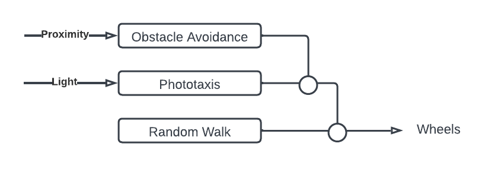
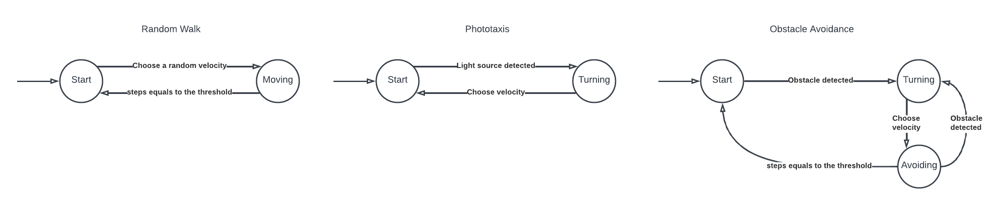

# Lab 03: The Subsumption Architecture

## Goal

The robot is expected to be able to find a light source and go towards it, while avoiding collisions with othe objects, such as walls, boxes and other robots. The robot should reach the target as fast as possible and, once reached it, it should stay close to it (either standing or moving). For physical constraints the wheel velocity cannot exceed the value 15 (i.e.,  152 m/s). The robot (a footbot) is equipped with both light and proximity sensors.

## Overview

The robot controller is designed by means of the subsumption architecture. This approach allows the definition of the robot behaviour in an incremental way, it is composed by three levels with different priorities. Each level might inhibit the levels below. 

- **Random Walk**: ability to perform random movements in the arena (it is the level with the lowest priority).

- **Phototaxis**: ability to go towards a light source, considering an arena without obstacles. Whenever the robot senses a light source this level inhibits the random walk level.

- **Obstacle avoidance**: ability to avoid obstacles. Whenever the robot senses a dangerous obstacle this level inhibits the levels below and sets the wheels velocities in order to avoid the collision with the obstacle. 

Each level might be considered as a Finite State Machine (even if Random Walk and Phototaxis are trivial):

## Implementation

Since in Argos only sequential processes can be run, the subsumption arichitecture has been implemented with some variants. In order to implement an extensible code each level is represented by a function, the step function only calls the level with the highest priority, then each level:
1. Calls the lower level 
2. Executes its behaviour, if it is needed it will inhibit the underlying levels, otherwise it let the signal they emit (i.e., the velocity) pass. 

## Performance 

To evaluate the performance of the robot's behavior, I carried out some experiments, all in the same arena with: 15 normal obstacles, 4 long obstacles, 3 high obstacles,  light intensity of 2.
The task of the robot is to reach the light (within a radius of 0.5) within a fixed time (1000 ticks).
In the first experiment, only one robot was present in the arena and it reached the objective 9 out of 10 times.
In the second experiment, there were 5 robots present and the results are as follows:

| Experiment | Succeeded Robots |
|------------|------------------|
| 1          | 3/5              |
| 2          | 3/5              |
| 3          | 4/5              |
| 4          | 4/5              |
| 5          | 0/5              |
| 6          | 3/5              |
| 7          | 4/5              |
| 8          | 4/5              |
| 9          | 4/5              |
| 10         | 4/5              |

## Considerations

Both experiments yielded satisfactory results, although in the second one there were some particularly unlucky cases that performed worse. Specifically, run number five had a block arrangement that prevented any robot from approaching the light within the predetermined radius.